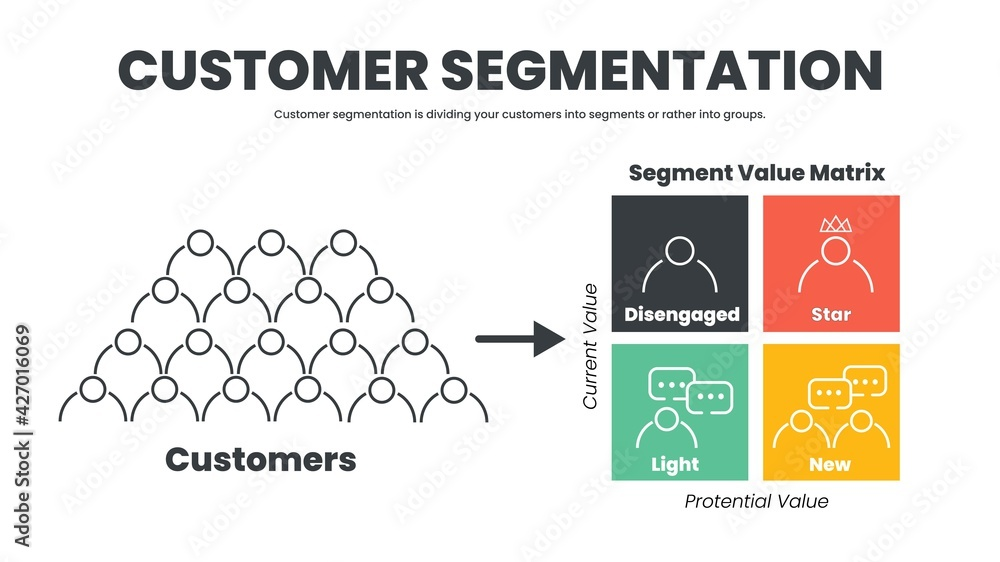

# Customer Segmentation & Association Project

## Table of Contents
1. [Introduction](#introduction)
2. [Dataset Information](#dataset-information)
3. [Notebook Objectives](#notebook-objectives)
4. [Analysis Workflow](#analysis-workflow)
5. [Conclusions & Future Improvements](#conclusions--future-improvements)

## Introduction

### Problem Statement
The objective of this project is to develop a comprehensive data analysis pipeline to explore, preprocess, and derive insights from a given dataset. The analysis will include exploratory data analysis (EDA), dimensionality reduction using techniques like PCA, clustering to identify patterns, and association rule mining to discover relationships between variables. The goal is to extract valuable insights from the data and provide actionable recommendations for decision-making.

## Dataset Information
The dataset includes demographic details of customers, covering factors such as age, marital status, family size, education level, and income. Additionally, it includes responses to a survey that encompasses various aspects of perspectives and behaviors as well as insights into product buying patterns.

## Notebook Objectives
The study aims to analyze the dataset to identify and understand the economic and demographic factors that influence respondents' perspectives and behaviors. By employing data analysis techniques and machine learning algorithms, this case study aims to answer the following questions:
- How do economic factors such as income and education level correlate with customers' perspectives and behaviors?
- Are there any significant relationships between marital status, family size, and customers' attitudes or behaviors?
- Can we identify and segment customers based on their demographic profiles and behaviors?
- What insights can we derive from the responses regarding customers' preferences, concerns, or tendencies?

By addressing these questions, we aim to gain a deeper understanding of the factors driving customers' perspectives and behaviors. This understanding can be used for decision-making in areas such as marketing strategies, policy development, and social interventions.

## Analysis Workflow
1. **Importing Required Libraries:** Load necessary Python libraries for data manipulation, visualization, and machine learning.
2. **Reading Dataset:** Load the dataset for analysis.
3. **Data Cleaning:** Handle missing values, remove duplicates, and prepare the data for analysis.
4. **EDA - Exploratory Data Analysis:** Perform descriptive statistics and visualizations to understand the data distribution and correlations.
5. **Data Preprocessing:** Encode categorical variables and scale the data for machine learning algorithms.
6. **Dimensionality Reduction:** Apply PCA to reduce the dimensionality of the dataset and visualize the principal components.
7. **Clustering:** Use clustering algorithms to identify distinct groups within the data.
8. **Association Rule Mining:** Apply the Apriori algorithm to discover interesting associations between variables.
9. **Conclusions & Future Improvements:** Summarize the findings and suggest potential areas for further research and analysis.

## Conclusions & Future Improvements

### Conclusions
This study successfully applied various data analysis techniques to the given dataset. Key insights were derived regarding the correlations between demographic factors and customer behaviors. Clustering helped identify distinct customer segments, and association rule mining revealed interesting relationships between different variables.

### Future Improvements
Future work could include:
- Using more sophisticated clustering algorithms like DBSCAN or hierarchical clustering.
- Applying advanced association rule mining techniques to uncover deeper relationships.
- Expanding the dataset to include more variables for a more comprehensive analysis.
- Implementing predictive modeling to forecast customer behavior based on the identified patterns.

---

## Contact

